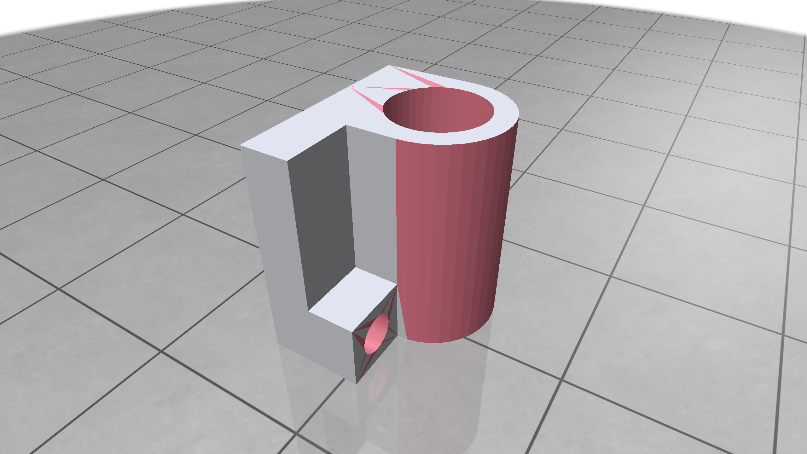
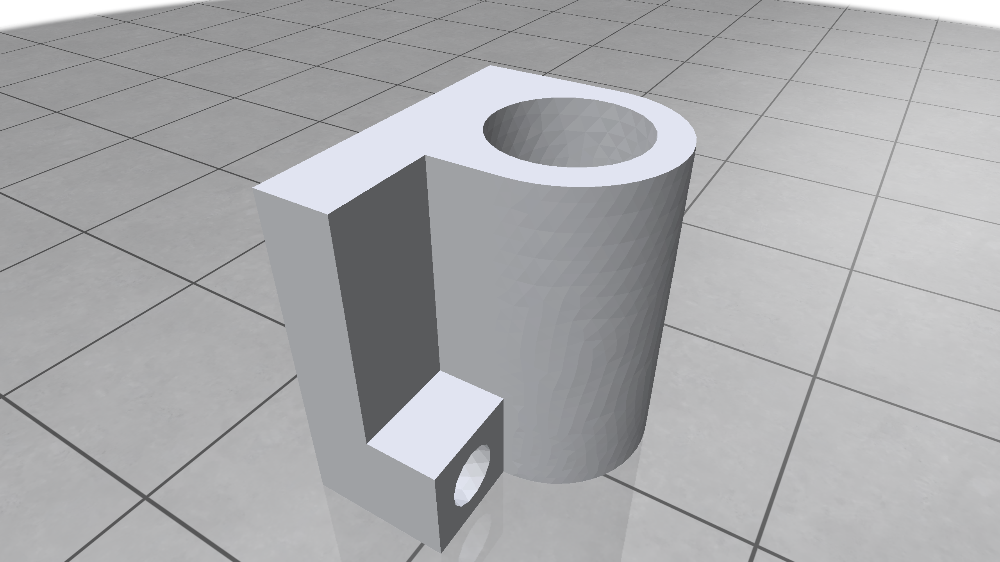
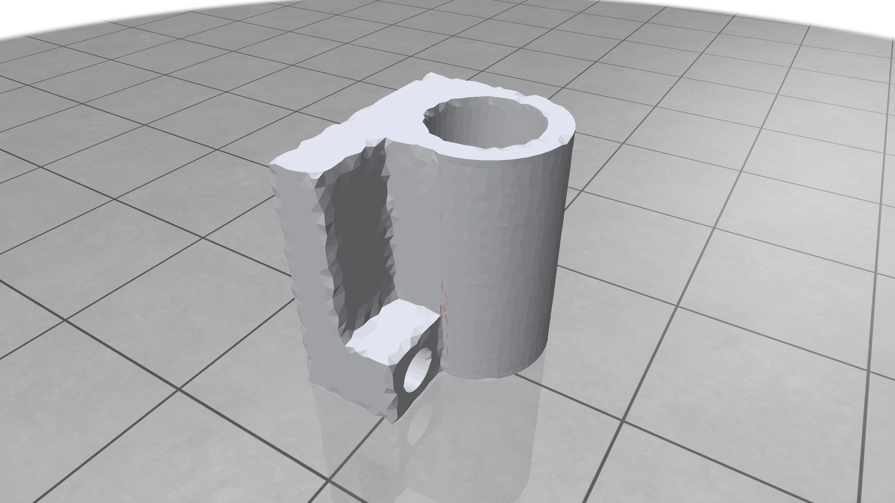
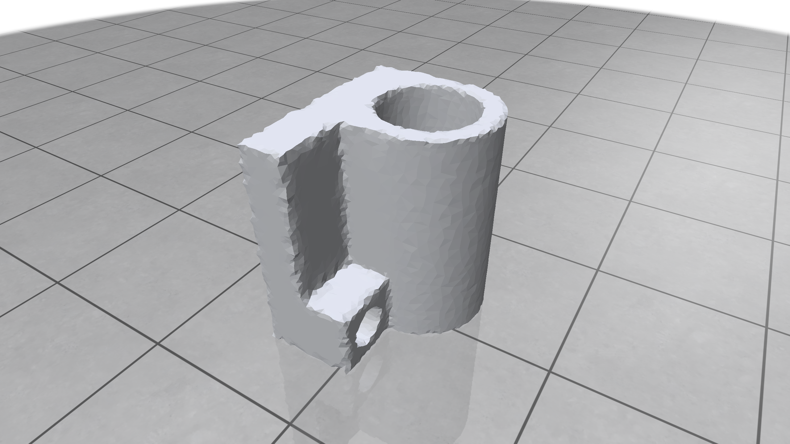
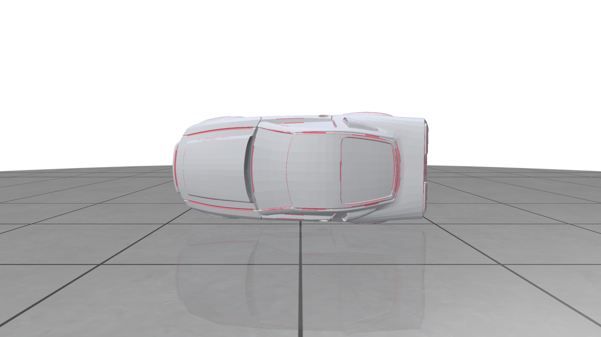
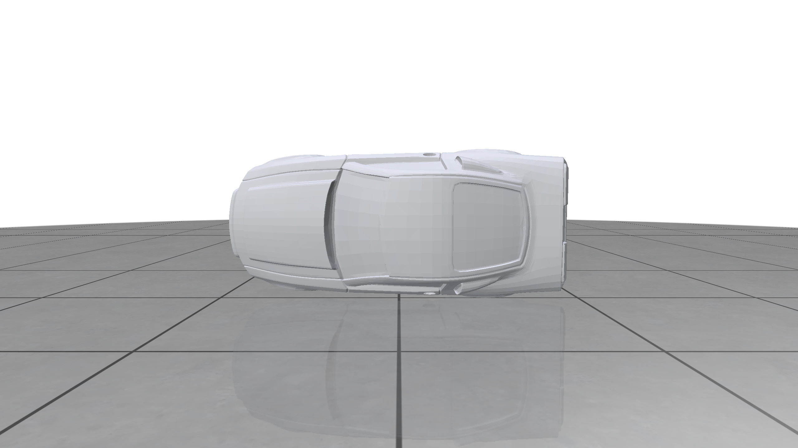
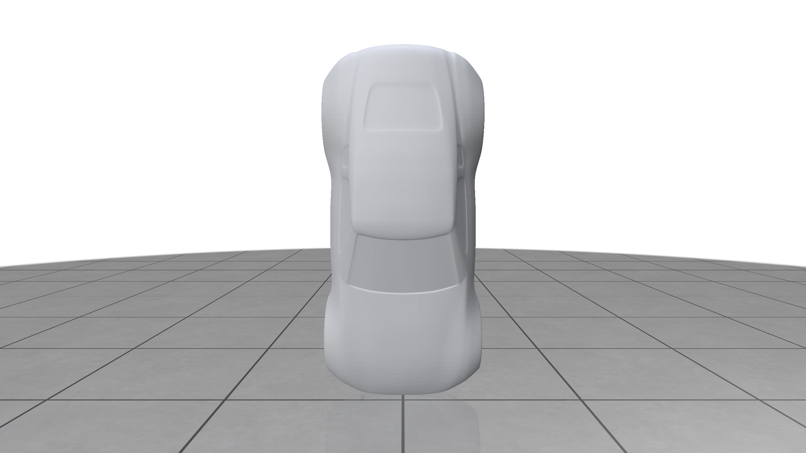

# Robust Mesh Quality Enhancement and Adaptive Remeshing

**Course:** CENG589 Digital Geometry Processing  
**Project topic:** Degenerate triangle removal and adaptive remeshing  
**Student:** Esad Mazi

## Abstract

Triangle meshes produced by CAD tessellators or other automatic conversion
tools may contain very skinny or nearly degenerate triangles. These triangles
are visually small, but they are harmful for geometry processing because they
lead to unstable normals, poor numerical conditioning, and unreliable downstream
operations. In this project, I implemented a mesh-quality pipeline inspired by
Botsch and Kobbelt's robust degenerate-face removal procedure and Dunyach et
al.'s adaptive isotropic remeshing approach.

The implemented system reads OFF meshes, measures triangle quality, visualizes
bad triangles, applies conservative remeshing operations, and finally removes
remaining degenerate triangles using targeted local operations. The pipeline was
tested on the provided joint model and two car models. On the joint model, the
number of detected bad triangles was reduced from 258 to 0 while preserving
closed topology. On the car models, the same cleanup idea removed almost all
detected bad triangles without introducing non-manifold edges.

## 1. Introduction

The initial motivation of this project was practical rather than theoretical:
the provided `joint_input.off` mesh visibly contained many thin triangles, while
the provided `joint_output.off` appeared to be a cleaned reference result. The
main goal was therefore to build a reproducible pipeline that can explain,
measure, and improve this difference.

The project follows three principles:

1. Quality must be measured, not only inspected visually.
2. Geometry processing operations must preserve topology whenever possible.
3. Intermediate failures should be treated as observations, because they explain
   why more careful algorithms are necessary.

This resulted in a pipeline that is intentionally simple but measurable. It does
not try to be a complete industrial mesh repair system; instead, it focuses on a
clear term-project scope: detect problematic triangles, improve them using local
remeshing operations, compare the result against the provided reference output,
and document the behavior on additional models.

## 2. Background

Botsch and Kobbelt classify degenerate triangles into two important categories:
needles and caps. Needles have very small angles and are usually long and thin.
Caps have an angle close to 180 degrees. The paper argues that these two cases
should not be handled identically. In particular, needles can often be removed
by collapsing short edges, while caps are more safely handled by splitting or
slicing operations.

Dunyach et al. propose adaptive isotropic remeshing for interactive mesh
deformation. Their key idea is to use a target edge length that changes over the
surface: high-curvature regions should be sampled more densely, while flatter
regions can be represented with larger triangles.

This project uses these ideas in a practical form:

- triangle quality analysis and classification
- conservative edge split and edge collapse operations
- targeted cleanup for needles and caps
- a curvature-based adaptive remeshing stage

## 3. Quality and Topology Metrics

For each triangle, the implementation computes:

- minimum angle
- maximum angle
- shortest-edge / longest-edge aspect ratio
- near-zero area status

The following thresholds are used in the experiments:

| Label | Criterion |
|---|---|
| Needle-like | minimum angle below 5 degrees or aspect ratio below 0.05 |
| Cap-like | maximum angle above 175 degrees |
| Near-zero area | area below a scale-dependent epsilon |

Topology is measured separately using:

- boundary edge count
- non-manifold edge count
- Euler characteristic

This separation became important during development. An early remeshing version
improved some angle metrics but created holes and non-manifold edges. Therefore,
the final pipeline reports both triangle quality and topology.

## 4. Implementation

The project is implemented in Python as a small command-line package named
`meshfix`. The main modules are:

| Module | Purpose |
|---|---|
| `meshfix.io` | OFF mesh reading and writing |
| `meshfix.quality` | triangle quality metrics and bad triangle classification |
| `meshfix.visualize` | colored PLY export and Polyscope visualization |
| `meshfix.topology` | boundary and non-manifold edge analysis |
| `meshfix.remesh` | uniform and adaptive remeshing operations |
| `meshfix.cleanup` | targeted needle/cap cleanup |
| `meshfix.curvature` | curvature proxy and adaptive sizing field |

Bad triangles are visualized with a simple color scheme:

| Color | Meaning |
|---|---|
| Gray | acceptable triangle |
| Red | needle-like triangle |
| Orange | low aspect ratio triangle |
| Purple | cap-like triangle |
| Black | near-zero area triangle |

## 5. Method

### 5.1 Baseline Analysis

The first step is to read the input OFF mesh and compute quality statistics
without changing the geometry. This gives an objective baseline for comparison.
For example, `joint_input.off` contains 258 detected bad triangles, while the
provided `joint_output.off` contains none under the same thresholds.

**Figure 1.** Quality visualization of the provided `joint_input.off`. Red
triangles indicate needle-like degenerate triangles.

**Figure 2.** Quality visualization of the provided `joint_output.off`. The mesh
is almost entirely gray, confirming it as a clean reference output.

### 5.2 Conservative Uniform Remeshing

The first remeshing stage attempts to regularize edge lengths using local
operations:

- split edges that are too long
- collapse edges that are too short
- reject operations that would create invalid topology

The initial implementation was intentionally tested visually and numerically. It
revealed a common remeshing problem: splitting one triangle without consistently
splitting its neighbor can create cracks or T-junction-like artifacts. This was
fixed by globally consistent edge splitting, where all triangles sharing a split
edge use the same midpoint.

Another issue appeared with aggressive smoothing and edge flips. They improved
some angle statistics but caused visible deformation and small topology defects.
For this reason, the final uniform remeshing baseline uses conservative split
and collapse operations, while flip and smoothing are kept as optional
experimental flags.

**Figure 3.** Conservative uniform remeshing result. The number of bad triangles
is greatly reduced, but some red and purple triangles remain.

### 5.3 Targeted Degenerate Cleanup

Uniform remeshing alone does not remove all degenerate triangles. The next stage
uses the distinction between needles and caps:

- For needle-like triangles, collapse the shortest edge.
- For cap-like triangles, split the longest edge.

Each candidate operation is checked before it is accepted. Operations that would
introduce non-manifold edges or boundary changes on closed meshes are rejected.
This targeted cleanup stage reduced the remaining bad triangles on the joint
model from 43 to 0.

### 5.4 Adaptive Remeshing

The adaptive stage follows the idea of Dunyach et al. by replacing a single
global target edge length with a local sizing field. I implemented a simple
curvature proxy based on vertex normal variation over one-ring edges. The
resulting rule is:

- high normal variation: smaller target edge length
- low normal variation: larger target edge length

On the joint model, adaptive remeshing improved the average minimum angle and
reduced the number of triangles compared to the uniform-cleanup result. A final
targeted cleanup pass was then applied to remove the few bad triangles created
by adaptive operations.

**Figure 4.** Final result of the implemented pipeline on the joint model. All
detected bad triangles are removed and the topology remains clean.

## 6. Results

### 6.1 Joint Model

| Mesh | V | F | Min angle | Avg min angle | Bad triangles | Boundary | Non-manifold |
|---|---:|---:|---:|---:|---:|---:|---:|
| `joint_input.off` | 221 | 446 | 0.48 | 9.35 | 258 | 0 | 0 |
| `joint_uniform_safe.off` | 6537 | 13078 | 0.06 | 35.19 | 43 | 0 | 0 |
| `joint_adaptive_final.off` | 6061 | 12126 | 5.65 | 42.13 | 0 | 0 | 0 |
| `joint_output.off` | 3400 | 6804 | 36.00 | 53.00 | 0 | 0 | 0 |

The final adaptive result reaches the same bad-triangle count as the instructor
reference output: zero. It does not exactly reproduce the reference mesh, and it
uses more triangles, but it demonstrates the intended cleanup behavior with a
fully implemented and reproducible pipeline.

### 6.2 Car Models

The car models are already much denser than the joint model. For these meshes,
targeted cleanup was more practical than full adaptive remeshing. Direct
adaptive remeshing on `car4` over-refined the mesh and became computationally
expensive, so it was not used as the final car-model pipeline.

| Mesh | V | F | Min angle | Avg min angle | Bad triangles | Boundary | Non-manifold |
|---|---:|---:|---:|---:|---:|---:|---:|
| `car1.off` | 48798 | 97536 | 0.73 | 27.04 | 1400 | 64 | 0 |
| `car1_cleanup.off` | 48349 | 96638 | 4.64 | 27.28 | 4 | 64 | 0 |
| `car4.off` | 14317 | 28630 | 0.59 | 18.76 | 4787 | 0 | 0 |
| `car4_cleanup.off` | 12308 | 24612 | 0.95 | 21.68 | 5 | 0 | 0 |

For `car1`, the original mesh already has 64 boundary edges. The cleanup stage
preserves this count and does not introduce non-manifold edges. For `car4`, the
mesh starts closed and remains closed.

**Figure 5.** Quality visualization of `car4.off`. Many red triangles are
visible before cleanup.

**Figure 6.** Quality visualization of `car4_cleanup.off`. The bad triangle
count is reduced from 4787 to 5.

The optional `car1` visualizations are included below for completeness.

**Figure 7.** Quality visualization of `car1.off`.

**Figure 8.** Quality visualization of `car1_cleanup.off`.

## 7. Encountered Problems and Observations

Several implementation issues were useful for understanding the problem:

1. **Naive splitting can break topology.**  
   The first remeshing attempt split individual triangles independently. This
   created missing faces and visible cracks. The fix was globally consistent
   edge splitting.

2. **Improving triangle angles is not enough.**  
   Some early outputs had better angle statistics but worse topology. This is
   why boundary and non-manifold edge counts are reported in all experiments.

3. **Smoothing may deform the shape.**  
   Laplacian-like smoothing improved triangle regularity but visibly changed
   the object. Projection back to the original surface helped, but the final
   conservative pipeline avoids relying on smoothing.

4. **Cleanup should be type-specific.**  
   Splitting the longest edge of every bad triangle made some cases worse. The
   better rule was to collapse shortest edges for needles and split longest
   edges for caps.

5. **Adaptive remeshing is useful but sensitive.**  
   It improved the joint result, but on larger car models it over-refined the
   mesh without additional acceleration or better parameter control.

6. **Feature preservation remains important.**  
   Some small bumps near sharp edges remain visible. This is expected because
   explicit feature-edge preservation using dihedral angles is not implemented.

## 8. Limitations

This project deliberately keeps the method simple and transparent. The main
limitations are:

- no explicit feature-edge preservation
- no exact Hausdorff-distance error bound
- no spatial acceleration for nearest-surface or adaptive operations
- cleanup stopping criteria are still parameter-based
- adaptive remeshing parameters are tuned manually

These limitations are acceptable for the scope of the term project, but they
also suggest clear future improvements.

## 9. Conclusion

The project produced a working and measurable mesh-quality enhancement pipeline.
The implemented method successfully removes all detected bad triangles from the
provided joint input mesh while preserving topology. It also performs well on
additional car models, reducing thousands of detected bad triangles to only a
few remaining cases without introducing non-manifold edges.

The most important lesson from the project is that robust mesh processing should
not be evaluated only by visual appearance or triangle-angle statistics.
Topology preservation, failure cases, and parameter sensitivity must also be
measured. The final pipeline reflects this lesson: it combines quality analysis,
visualization, conservative operations, targeted cleanup, and adaptive remeshing
into a reproducible workflow.

## 10. References

1. Mario Botsch and Leif P. Kobbelt. *A Robust Procedure to Eliminate
   Degenerate Faces from Triangle Meshes*. VMV, 2001.
2. Marion Dunyach, David Vanderhaeghe, Loic Barthe, and Mario Botsch.
   *Adaptive Remeshing for Real-Time Mesh Deformation*. Eurographics Short
   Papers, 2013.

## 11. Reproducibility

The main commands are documented in `README.md`.

Important output files:

- `outputs/meshes/joint_adaptive_final.off`
- `outputs/meshes/car1_cleanup.off`
- `outputs/meshes/car4_cleanup.off`
- `outputs/experiment_summary.csv`
- `outputs/joint_adaptive_final_metrics.csv`

The code is organized under the `meshfix/` package and can be run from the
project root using `python3 -m meshfix.cli`.
